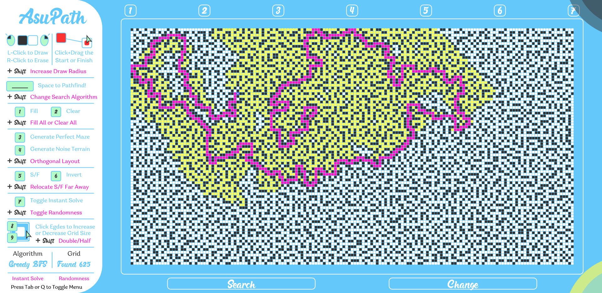

# AsuPathFinder

Welcome to my very own Pathfinding Visualizer! Inspired by a friend, we started discussing graph theory and I wanted to instinctively develop the essential searching algorithms on my own. Afterwards, we also looked into maze generation.

Try it on my github website: https://asdera.github.io/AsuPathFinder

Try it here on p5js.org: https://editor.p5js.org/asdera/present/DgtWKx7cX

## Summary of the Features

This features of the elite Asu Pathfinding Visualizer includes:

**Four Different Search Algorithms**: Each can be useful for different purposes. It includes my favourite, the king of search algorithms, A Star Platnium Search. Press shift+space to switch between them!

**Epic Visual Effects**: See the algorithm and the nodes being search in real time with appealing animations. Just press space!

**Easy to Edit and create layouts**: It's super easy to start drawing and creating pixel art. There are also a ton of shortcuts to draw some cool layouts to be searched. A useful keybinds is shift+9 which doubles the grid size. Use shift+8 to half the grid size instead.

**Maze and Terrain Generation**: Can create perfect mazes which only a single possible path. It can build a recursive rectangular maze or a more challenging diagonal maze (ALOT more randomness) with the Kruskal's algorithm. Can also create random terrians generated by noise. Press 3 for mazes, 4 for terrain.

**Quality of Life Tools**: Tired of waiting for the animation? Press 7 to instantly solve any layout. Trying to position the Start and Finish as far away as possible? Press shift+5 to find the longest path and place the Start and Finish accordingly.

*And there's more...*

## Bug Reports

If you notice any calculation errors, searching faults, crashes, intense lag or other bugs, it'd be super helpful if you could make an issue or send me a message/email :)

